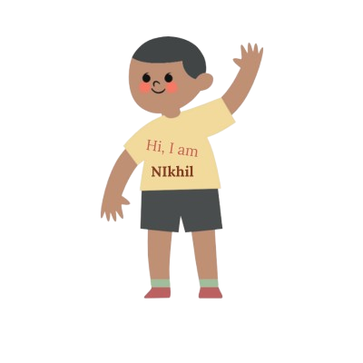
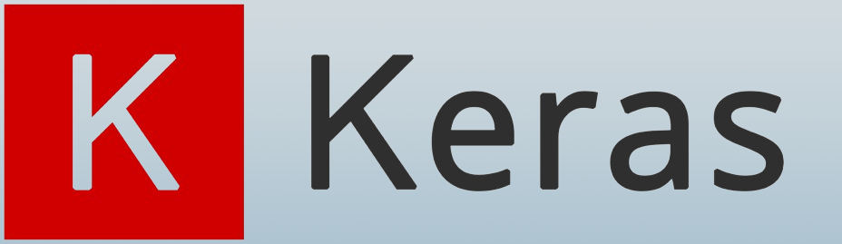

<h3 align="center">AI/ML Enthusiast From India</h3>
 

  

- 🔭 I’m currently working on **ELIZA**

- 🌱 I’m currently learning **Machine Learning**

- 📫 How to reach me: [pandeynikhilone@gmail.com](mailto:pandeynikhilone@gmail.com)

- ⚡ Fun fact: **I love cooking!**

<!-- - Tweaking this README for optimal engagement 
- [fullstack web3 development course](https://github.com/sammorozov/full_course_crypto_32) 
- [ethernaut tasks](https://github.com/sammorozov/ethernaut_source_tasks)
- Various bots and scripts, with results showcased [here](https://t.me/from_the_teapot_to_the_investor)
 -->

## Languages and Tools 

### Languages:
| Python3 | C | JS | C++ | HTML | CSS |
|----------|----------|----------|-------|-------|------|
|  |   |   |   |  | | 

### Best frameworks and main libraries for Python3:

| Tensorflow | Keras | Numpy | Pandas | Sklearn | Matplotlib | Django | flask |
|----------|----------|----------|----------|----------|----------|----------|----------|
|  |  |  |  |  |  | |

### My tools for Data Manipulation:

| Conda | Jupyter | Spark | MySQL | Postgres | SQLite |
|----------|----------|----------|----------|----------|----------|
|||||||

### Environments, Testing, Other:

| nodejs | Git | Docker | Pytest | Swagger | Postman | Virtual Box| HardHat |
|----------|----------|----------|----------|----------|----------|----------|----------|
|||||  |  || |

### OS: ❤️ (linux one love)

| Linux | Ubuntu | Kali |
|----------|----------|----------|
|  |  |  |
